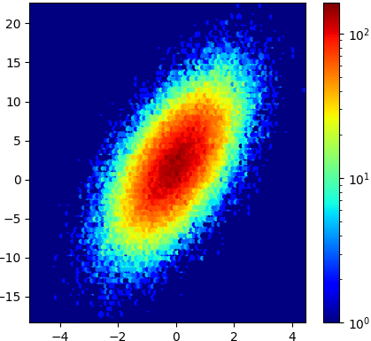

# Data Analytics (CS301) 

## Course Final Project

Please read this document carefully for all relevant details about the project. 

## Due Dates

**Note:** Deadlines are strict—no extensions will be granted.

- **Assigned:** Wednesday, November 13, 2024
- **Proposal Due:** Wednesday, November 20, 2024, by 2:30 PM
- **Reflection Document Due:** Monday, December 9, 2024, by 9:00 AM
- **Presentations:** Wednesday, December 4, 2024, during lab; Friday, December 6, 2024, during class if necessary.

<center>
&#x200B;

</center>

*Figure 1:* The raw data, in its textual form, is an unreadable script that usually tells us little about its story. However, by employing the actors 'color' and 'texture' to play out their script, the characters 'patterns' and 'trends' become more apparent and take center stage.

## Objectives

- Conduct advanced research to address an original question using data analysis.
- Obtain relevant data for the research.
- Explore statistical tools necessary for evaluating the data.
- Formulate conclusions based on the analysis.

**Note:** By this stage in the course, you should have already worked with various statistical tools for handling different types of data formats. Therefore, it is expected that you will be able to research code development and resolve any data formatting issues while working on your analysis. In particular, these skills involve researching R statistical software packages and applying them to specific contexts, as well as interpreting and explaining results supported by your methods and data.

## Group Work

You are welcome to work in pairs (maximum of **two** members per group).

## Project Overview

The final project requires you to apply the methods explored throughout the course to conduct a comprehensive research project involving (but not limited to) the following items.

- Analysis,
- Proposing and testing hypotheses,
- Manipulation of _real-world-dataset(s),
- Preparation of executable code,
- Creation of reasonable conclusions.

You will select an application area of interest, define exploratory questions, find an appropriate data set, perform an in-depth analysis, create visualizations, and discuss your findings in the context of the chosen application area. As you work, consider ethical issues, privacy concerns, and power dynamics related to your topic.

During the analysis, you will go through steps such as data collection, cleaning and transformation (if necessary), wrangling, correlation, modeling (if required), and visualization. Your aim is to tell a compelling story about a trend identified in the data, as depicted in Figure 1.

Since data analysis often aims to communicate information visually to influence policy or raise awareness, your report should argue for or against the continuation of a specific policy (either current or proposed). You may either critique an existing policy or advocate for a potential one, based on your data analysis.

## Assignment Specifications

This project is broad in scope, and you may use any tools or techniques from the course or your own research. To complete the assignment, choose an application area that interests you and is relevant to your exploratory questions (e.g., health, politics, economics, etc.).

1. **Select exploratory questions:** Choose three or four substantial questions that can be answered through data analysis. These should be meaningful inquiries related to your chosen topic.

2. **Find a data set:** Identify a real-world data set that you can analyze. The data set should be large, free, public, and available online. Make sure to check the credibility of the data source. For ideas, refer to the list of sites on the course's [resources page](https://www.oliverbonhamcarter.com/resources/dataanalytics_resources/).

3. **Conduct analysis:** Perform a thorough analysis of the data, addressing your exploratory questions, formulating new questions as you progress, and commenting on any issues with the data or analysis process.

You are encouraged to explore new data sets that are publicly available online. Make sure to use a new dataset that you have not used for any other project.

## Requirements

1. **Read the textbooks:** You are expected to consult the course textbooks:
   - Silge et al. [1]
   - Wickham et al. [2]

2. **Literature review:** Find at least two (2) academic references related to your chosen area and questions. These should be peer-reviewed scholarly articles from reputable sources (use Google Scholar). Avoid using blogs or unverified websites.

3. **Scope of your study:** Clearly define your research question, ensuring it is manageable and suitable for data analysis. Choose a topic that can be addressed within the scope of the project, and avoid overly broad questions with too many sub-questions.

4. **Data:** Select a large, real-world data set that is public, available online, and from a credible source. Perform searches to ensure the data set can be referenced in academic work. You may use data from the course's resources page or search for new data sets independently.

5. **Code:** While we did not spend much time on Python, you may decide to use this programming language instead of R. No matter which langauge you use, the code should execute without error. Please be sure to include instructions for running the code, including which libraries are necessary to install or load before execution. In addition, please be sure that the code is well documented so that your team member (and your instructor) will be able to follow your work and its thinking.

6. **Wrangling:** You may need to clean and transform the data using functions like `filter()`, `mutate()`, and others covered in class. Be sure to show your code and justify any steps taken to organize your data.

7. **Analysis:** In your report, explain your analysis method. What measurements will you take? Which techniques will you use? How did you process and detect those measurements?

8. **Design and development:** Develop your analysis using R software libraries. Your analysis should include basic statistics to provide an overall view of the data, as well as techniques to explore relationships between variables. If building a predictive model, attempt to confirm or refute a hypothesis.

9. **Plots:** Include visualizations that summarize and interpret your results. Address any inherent flaws in the data (e.g., missing entries, skewed populations, small sample sizes). Discuss potential biases, stereotypes, and other issues that may affect the data collection and analysis process.

10. **Commit log and group effort:** Your GitHub commit log must show continuous progress (avoid clusters of commits at the last minute). If the log shows unequal contributions between team members, grade reductions will be applied to non-contributing members.

---

## Parts to Complete

### Part 1: Proposal

**Deadline:** Wednesday, November 20, 2024, by 2:30 PM.

Collaborate with your group to draft a two-paragraph (half-page) proposal. In this proposal, introduce the motivation behind your project, outline three or four key questions you aim to address through analysis, and cite the dataset you plan to use. Additionally, discuss your hypotheses regarding these questions. The proposal will allow the instructor to provide feedback on the project's direction.

### Part 2: Presentation

**Presentations:** Wednesday, December 4, 2024, during lab and Friday, December 6, 2024, during class (if necessary).

By this time, your project should be nearly complete. Present a 5-7 minute summary of your questions, data set, methods, and any preliminary results. Updates on your progress are also expected.

### Part 3: Reflection Document

**Deadline:** Monday, December 9, 2024, by 9:00 AM.

Your final report should be thoroughly reviewed for spelling, grammar, and completeness. Ensure all objectives have been addressed as outlined in the README.md file.

---

## Important Details

- Include your name on all submissions. If no names are provided, the instructor will be unable to assign credit.
- Submit executable code that can run without modifications. All code should be un-commented, and non-code areas should be commented out to avoid interfering with execution.

---

## Required Deliverables

- A complete, executable source code file (`src/code.r`) that the instructor can run without additional edits.
- A `writing/reflection.md` file with your responses to the questions outlined in the project.

## References

[1] Julia Silge and David Robinson. *Text Mining with R: A Tidy Approach*. O'Reilly Media, Inc., 2017.  
[2] Hadley Wickham and Garrett Grolemund. *R for Data Science: Import, Tidy, Transform, Visualize, and Model Data*. O'Reilly Media, Inc., 2016.

---

### Checks for GatorGrader

To receive immediate feedback on your submission, we will use GatorGrade. The tool will inform you if any components are missing. A red X will appear until all components are included, at which point it will change to a green check mark. You are encouraged to click the red X for a list of missing components.

## Project Assessment

The grade will be based on the following components:

- **GitHub Actions CI Build Status [up to 5%]:** You will receive a checkmark grade for passing the build status if your last commit before the deadline passes the basic requirements. Significant late commits or gaps in your commit log may result in deductions.
- **Mastery of Technical Writing and Implementation [up to 65%]:** The majority of your grade will depend on the quality of your source code (correctness, efficiency, and documentation) and the depth of your reflection in `reflection.md`, including writing and technical knowledge.
- **Presentation [up to 30%]:** You will receive credit for your presentation if you are present and actively contribute.

---

## GatorGrade

To check your writing and commit requirements, use the department's `gatorgrade` tool. Make sure Python3 is installed (type `python --version` to verify) and follow these installation instructions:

- [Installing Python on Windows](https://realpython.com/lessons/python-windows-setup/)
- [How to Install Python 3](https://realpython.com/installing-python/)

Then, install `gatorgrade`:

```
pipx install gatorgrade
```

Run `gatorgrade`:

```
gatorgrade --config config/gatorgrade.yml
```

## Submitting Your Work

To submit your work via GitHub, use the following commands:

```
git add -A
git commit -m "add meaningful commit message"
git push
```

## Seeking Assistance

If you have questions, post them in the course’s Discord channel or attend the instructor's or TL's office hours.

For more resources, see:

- [Markdown Tidbits](https://www.youtube.com/watch?v=cdJEUAy5IyA)
- [Markdown Cheatsheet](https://github.com/adam-p/markdown-here/wiki/Markdown-Cheatsheet)
